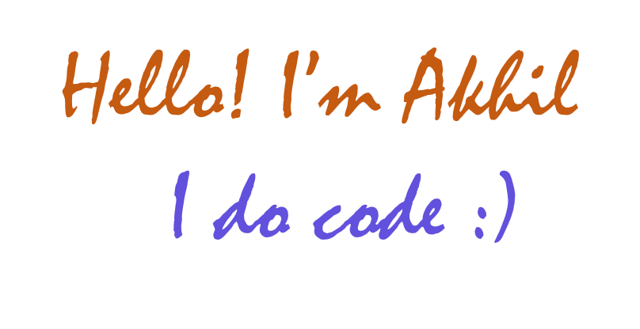

<div align="center">
  
</div>

### A little about me... (Not so important..)

```java
public class Akhil {
    public static void main(String[] args) {
        String[] pronouns = {"He", "Him"};

        String education = "Final Year Student at Centurion University of Technology and Management"; // Still figuring it out
        String[] codingLanguages = {"Java", "JavaScript", "Python", "C", "PHP", "Shell scripting"};
        String[] frontEnd = {"React", "Tailwind", "HTML", "CSS"};
        String[] backEnd = {"SpringBoot", "Java", "PHP"}; //This has my Heart
        String[] database = {"MySQL", "Postgres", "MongoDB", "Firebase", "Redis"};
        String[] other = {"Git", "GitHub", "Markdown", "Docker", "GraphQL", "VSCode", "Android Studio"};
        String[] testingFrameworks = {"JUnit", "Surefire"}; //Do we need These...?
        String[] automation = {"Selenium"};
        boolean working = true; //Pretending to work...while really listening to music

        if (working) { 
            try {
                listenMusic(true); // If this throws an error, it's probably because my mind hates me
            } catch (Exception sleep) {
                throw new RuntimeException("Error occurred while trying to listen to music: Music is life!");
            }
        } else {
            while (true) {
                sleep(); //Just sleep forever.....
            }
        }

        // Final thoughts 
        System.out.println("Code finished. It's hard to write this....So it should be Hard to understand.....!");
    }
}
```
<div align="center">
  
</div>

### Get in touch :)
[](https://www.linkedin.com/in/akhil-kumar-madineni/)
<a href="mailto:akhilkumarmadineni@gmail.com"></a>


